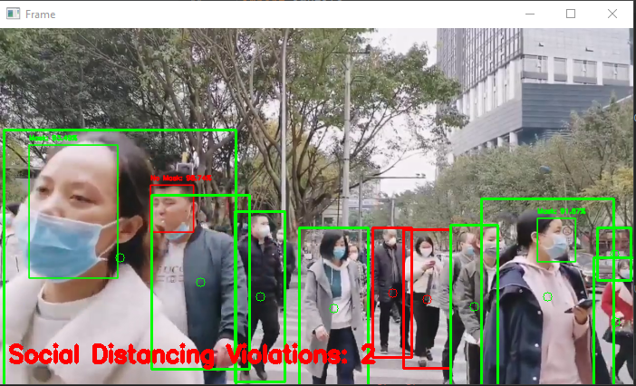

# Python-Covid-Preventor
Python-Covid-Preventor is a python application that detect social dsitance and wether people are wearing a mask or not from live feed or a video
it was made with OpenCV, Keras/TensorFlow, and Deep Learning.


## Installation

 before you start the project you need first to get a file that i putted in google drive and here is the link down below, i couldn't upload it
 on github because i had some issues with it's volume being too big to upload.

```bash
https://drive.google.com/file/d/1U4T-Rmi8ovNLfakBiwIBYUssHAUesx3I/view?usp=sharing
```

## Usage

you can download all the necessary python libraries via this link that i used to create this project

```bash
https://www.pyimagesearch.com/2020/05/04/covid-19-face-mask-detector-with-opencv-keras-tensorflow-and-deep-learning/
```
## Screen Shot



## Contributing
Pull requests are welcome. For major changes, please open an issue first to discuss what you would like to change.

Feel free to clone the repo and run the code on your computer.

## License
[MIT](https://choosealicense.com/licenses/mit/)
